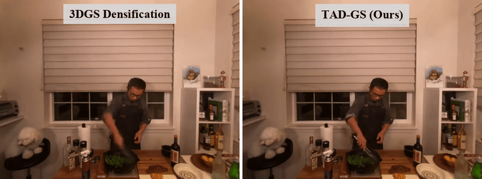

<h2 align="center">TAD-GS: Temporally Aware Densification for Dynamic 3D Gaussian Splatting</h2>

<p align="center">
  <a href="https://vikramsandu.github.io/"><strong>Vikram Sandu</strong></a>
  ·
  <strong>Mayurdeep Pathak</strong>
  ·
  <strong>Rajiv Soundararajan</strong>
  <br>
  Indian Institute of Science, Bengaluru
  <br>
  ECCV 2026
</p>

<p align="center">
  <a href="https://vikramsandu.github.io/publications/TADGS/index.html"><strong><code>Project Page</code></strong></a>
  <a href="https://arxiv.org/abs/2606.23212"><strong><code>Arxiv Paper</code></strong></a>
  <a href="https://github.com/vikramsandu/TAD-GS"><strong><code>Source Code</code></strong></a>
</p>

<div align='center'>
  <br>
  
  <br>Existing 3DGS densification fails to refine short-lived dynamic Gaussians, resulting in blurry reconstructions. TAD-GS recovers highly dynamic regions.
</div>

<br>

## Contents

1. [Setup](#setup)
2. [Preprocess Datasets](#preprocess-datasets)
3. [Training](#training)
4. [Evaluation](#evaluation)
5. [Pretrained Models](#pretrained-models)
6. [Citation](#citation)

## Setup

## Preprocess Datasets

## Training

## Evaluation

## Pretrained Models

## Citation

If you find this work useful, please cite:

```bibtex
@article{sandu2026tadgs,
  author    = {Sandu, Vikram and Pathak, Mayurdeep and Soundararajan, Rajiv},
  title     = {Temporally Aware Densification for Dynamic 3D Gaussian Splatting},
  journal   = {ECCV},
  year      = {2026},
}
```
